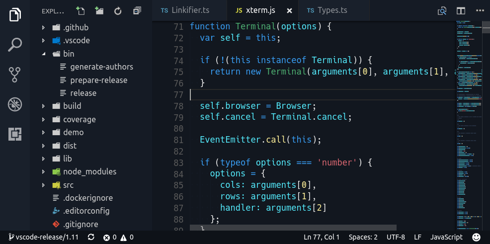

# vscode-theme-generator

[](https://travis-ci.org/Tyriar/vscode-theme-generator)

This is a preview that leverages the new VS Code theming options in v1.12.

**The Problem**

- New themes are typically forked from other themes, carrying the bugs with them
- .tmThemes are overly verbose and difficult to maintain
- Themes are difficult to write from scratch

**The Solution**

What if all you needed to do to generate a theme was specify a few colors and everything else was handled for you? Well that's what this module aims to accomplish. All you need to do is specify a set of "base colors" (background, foreground and 4 accent colors) and you have a reasonably good looking theme.

All other VS Code theme colors are then derived from those base colors, with the option to tweak each underlying color as well.

## Example

This is all that's needed to generate a great looking theme:

```ts
import { generateTheme, IColorSet } from 'vscode-theme-generator';
const colorSet: IColorSet = {
  base: {
    background: '#12171F',
    foreground: '#EFEFEF',
    color1: '#399EF4',
    color2: '#DA6771',
    color3: '#4EB071',
    color4: '#FFF099',
  }
};
generateTheme('My Theme', colorSet, path.join(__dirname, 'theme.json'));
```



## Getting started

There's a [quick start repository](https://github.com/Tyriar/vscode-theme-generator-quick-start) that allows you to get started quickly, just clone and run!

```bash
git clone https://github.com/Tyriar/vscode-theme-generator-quick-start
cd vscode-theme-generator-quick-start
npm install
```

Make your changes to the colors in index.ts and hit F5 to build the theme and launch a new VS Code window with your theme available in the command palette (`ctrl`/`cmd+shift+p` > "Color Theme").

## Advanced use

In addition to the `base` colors, `IColorSet` provides more options for `syntax`, `ui`, and `terminal`. There is also an `overrides` property, which allows you to set any color key from the [Theme Color Reference](https://code.visualstudio.com/docs/getstarted/theme-color-reference) directly.

Since the theme is defined in TypeScript, you can create an object to give names to colors you want to re-use.

```ts
const colors = {
  red: '#DA6771',
  green: '#4EB071',
  yellow: '#FFF099',
  blue: '#399EF4',
  blueLight: '#9FCFF9'
}

const colorSet: IColorSet = {
  base: {
    background: '#12171F',
    foreground: '#EFEFEF',
    color1: colors.blue,
    color2: colors.red,
    color3: colors.green,
    color4: colors.yellow
  },
  syntax: {
    identifier: colors.blueLight,
    string: colors.red
  },
  ui: {
    cursor: '#FFFFFF'
  },
  terminal: {
    blue: colors.blue,
    brightBlue: colors.blueLight
  },
  overrides: {
    'editorGutter.modifiedBackground': colors.green,
    'editorGutter.addedBackground': colors.blue,
    'editorGutter.deletedBackground': colors.red
  }
};
```

The `syntax` properties present a simplified set of token types. If not set, these will be derived from the base colors:

- `color1` determines `boolean`, `identifier`, `keyword`, `storage`, and `cssClass`
- `color2` determines `string` and `cssId`
- `color3` determines `function`, `class`, `classMember`, `type`, and `cssTag`
- `color4` determines `functionCall` and `number`

By default, `comment` is derived from the `background` color, and `modifier` and `markdownQuote` are not set.

The `ui` properties allow you to set colors for various highlights and a few other things:

- `cursor`: the cursor color
- `invisibles`: used for visible whitespace (see the `editor.renderWhitespace` VS Code setting)
- `guide`: indentation guidlines in the editor pane
- `lineHighlight`: colors the line your cursor is on, in place of the boundary lines
- `findMatchHighlight` and `currentFindMatchHighlight`: higlights matches from the find widget
- `findRangeHighlight`: highlights the selected area for "find in selection"
- `rangeHighlight`: background for a selected range of lines
- `selection`: highlights text selected with the cursor
- `selectionHighlight`: highlights text which matches the selected text
- `wordHighlight`: when the cursor is on a symbol, highlights places that symbol is read
- `wordHighlightStrong`: when the cursor is on a symbol, highlights places that symbol is written
- `activeLinkForeground`: color of hyperlinks when clicked

By default, `invisibles` and `guide` are derived from the `background` color, and the rest are not set.

The `terminal` properties include each of the standard 16 ANSI colors (`black`, `red`, `green`, `yellow`, `blue`, `magenta`, `cyan`, and `white`, plus their "bright" counterparts). To set the background color, add the `terminal.background` key under `overrides`.

## Support

Support below means that the standard VS Code grammar has explicit support for the languages, ie. the colors should match their meanings. Other languages will probably still look alright but there is no guarentee that they will.

- :white_check_mark: C#
- :white_check_mark: CSS
- :white_check_mark: HTML
- :white_check_mark: Java
- :white_check_mark: JavaScript
- :white_check_mark: Markdown
- :white_check_mark: TypeScript

## Roadmap

Below are several of the bigger planned items, community feedback is welcome :smiley:

- Support light themes [#22](https://github.com/Tyriar/vscode-theme-generator/issues/22)
- Allow styling of text style [#16](https://github.com/Tyriar/vscode-theme-generator/issues/16)
- Finalize and commit to API [#28](https://github.com/Tyriar/vscode-theme-generator/issues/28)
- Implement syntax color fallbacks [#27](https://github.com/Tyriar/vscode-theme-generator/issues/27)
- Refine background fallback values [#29](https://github.com/Tyriar/vscode-theme-generator/issues/29)
- Add API documentation [#30](https://github.com/Tyriar/vscode-theme-generator/issues/30)

## Development

```bash
npm run dev
```

Then in VS Code press <kbd>F5</kbd> to build demo and launch the debugger with the generated themes available to switch to.
